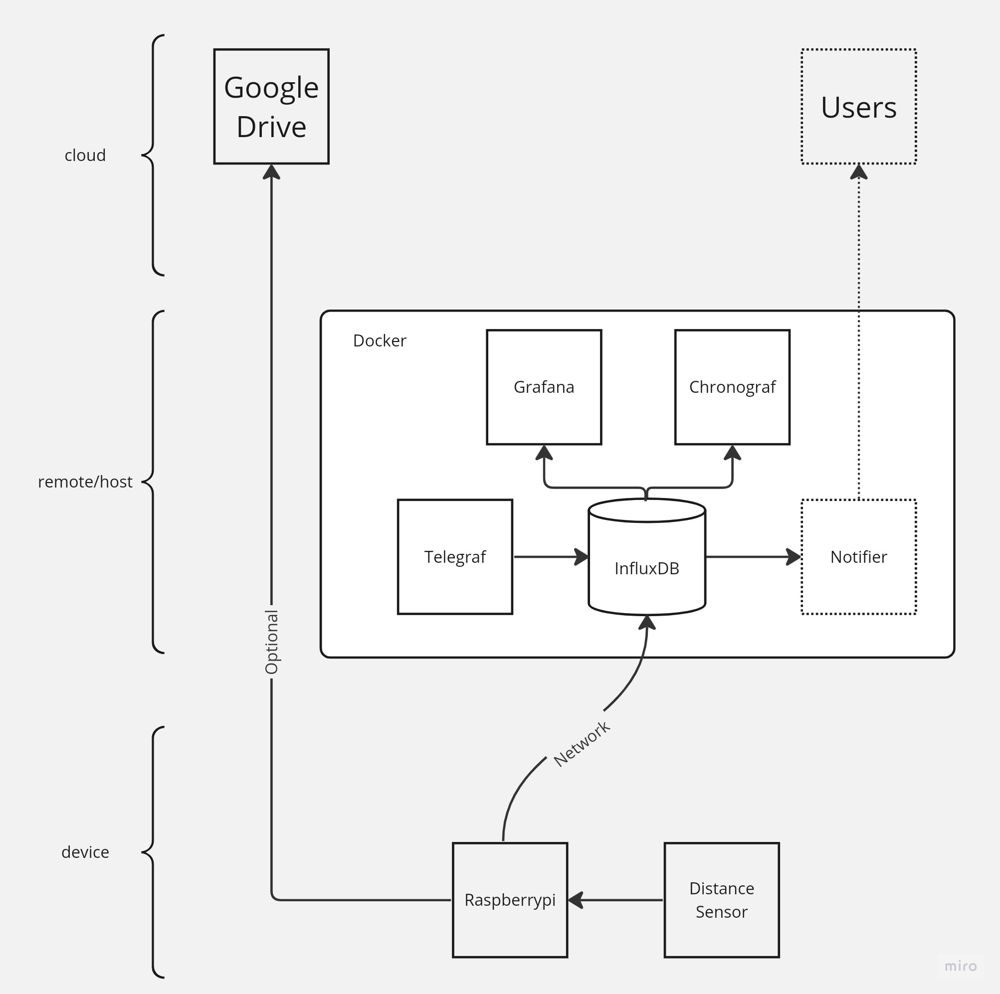

# playground

Distance Sensor Trough Detector Playground 

# Design

## Docker

1. influxdb (storage)
2. grafana (visualization)
3. chronograf (for influxdb web UI)
4. telegraf (optional: host machine performance specs)

## Raspberry Pi and Sensors

Structure: /sensors/\<measurement\>/\<type\>/\<hw_interface\>

### Distance Ultrasonic GPIO Sensor (HC-SR04)

This is used to interface with the Ultrasonic HC-SR04 Distance Detector Module

Here is a step-by-step guide on how to connect the HC-SR04 sensor to the Raspberry Pi 3 Model B:
1. Shutdown the Raspberry Pi and disconnect the power supply.
2. Identify the GPIO pins on your Raspberry Pi. The GPIO pins are usually labeled on the board. Refer to the pinout diagram for the Raspberry Pi 3 Model B to locate the GPIO pins (https://pinout.xyz/pinout/). You can also refer to docs/ within this repo.
3. Connect the HC-SR04 sensor's VCC pin to the Raspberry Pi's 5V pin. This provides power to the sensor.
4. Connect the HC-SR04 sensor's GND pin to the Raspberry Pi's GND pin. This establishes the ground connection between the sensor and the Pi.
5. Connect the HC-SR04 sensor's Trig pin to a GPIO pin on the Raspberry Pi. For example, you can connect it to GPIO 22.
6. Connect the HC-SR04 sensor's Echo pin to another GPIO pin on the Raspberry Pi. For example, you can connect it to GPIO 19.
7. Double-check that all the connections are secure and properly aligned.
8. Once the connections are made, power up the Raspberry Pi.

`sudo apt-get update`\
`sudo apt-get install python3-rpi.gpio`

### Distance TOF Board Sensor (VL53L1X)

This uses `board.I2C()` library

Here is a step-by-step guide on how to connect the VL53L1X sensor to the Raspberry Pi 3 Model B:

Gather the necessary components:
1. Raspberry Pi 3 Model B
2. VL53L1X distance sensor
3. Jumper wires
4. Identify the I2C pins on the Raspberry Pi:
- SDA (Serial Data Line): Connects to the sensor's SDA pin.
- SCL (Serial Clock Line): Connects to the sensor's SCL pin.
- 3.3V or 5V: Connects to the sensor's VCC pin for power.
- Ground (GND): Connects to the sensor's GND pin.

Make the physical connections:
1. Connect the SDA pin of the sensor to the SDA pin on the Raspberry Pi.
2. Connect the SCL pin of the sensor to the SCL pin on the Raspberry Pi.
3. Connect the VCC pin of the sensor to the 3.3V or 5V pin on the Raspberry Pi.
4. Connect the GND pin of the sensor to the Ground (GND) pin on the Raspberry Pi.
5. Once the hardware connections are made, you need to enable the I2C interface on the Raspberry Pi by following these steps:

- Open the terminal on the Raspberry Pi.
- Run the command `sudo raspi-config`.
- In the configuration menu, navigate to Interfacing Options.
- Select I2C and choose Yes to enable the interface.
- Reboot the Raspberry Pi for the changes to take effect.

Install the necessary Python libraries:
1. Open the terminal on the Raspberry Pi.
2. Run the command `pip install adafruit-circuitpython-vl53l1x`.

You can now use the Python class provided earlier to configure and connect to the VL53L1X sensor, as well as gather sensor data.

### Storage

#### Database

Install influxdb api to interact with the influxdb docker server

`pip install influxdb`

### Detection

Install the following for trough detection of multidimentional x,y series data

`pip install matplotlib`\
`pip install numpy`\
`pip install scipy`

## Test

Used to generate a data set to test trigger notification events,\
which are issued by the Trough Detectors

`pip install numpy`

## Google Cloud API

This is optional used to upload files to the Google Drive using Google Cloud Services API.

Run the following to install required libraries:

`pip install google-api-python-client`
